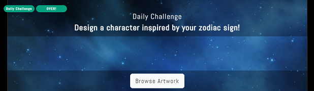

# CreativeSpark

CreativeSpark is a website created for artists of all skill levels, where daily drawing challenges will be provided for the community to participate in!
As most artists know, the more you draw the better you'll get, and the purpose of this website is to provide artists with inspiration, since there are times when you will run empty. 
A fun way to get ideas and improve your drawing skills!
Join the community and get tons of inspiration by participating in our drawing challenges, and browse amazing art submitted by your fellow artists! 

Link to live site: https://creativespark-project4.herokuapp.com/

- - - 

## Table of Contents

* [User Stories](#user-stories)
* [Agile Methodology](#agile-methodology)
* [Design](#design)
  * [Colour Scheme](#colour-scheme)
  * [Typography](#typography)
  * [Imagery](#imagery)
* [Features](#features)
    * [Existing Features](#existing-features)
    * [Future Features](#future-features)
* [Testing](#testing)
    * [Validator Testing](#validator-testing)
    * [Manual Testing](#manual-testing)
    * [Bugs](#bugs)
    * [Unsolved Bugs](#unsolved-bugs)
* [Technologies Used](#technologies-used)
  * [Main Languages](#main-languages)
  * [Frameworks, Libraries & Programs](#frameworks-libraries--programs)
* [Deployment](#deployment)
* [Credits](#credits)
  * [Code](#code)

  
- - -
## User Stories

### As an unauthenticated user, I can:
  * Easily navigate around the application to view most content.
  * Click the 'Signup' navigation link to register and become a member.
  * View all challenges as well as posts submitted to each challenge.
  * View full posts.
  * View comments.

### As an authenticated user, I can:
  * Perform all tasks mentioned above.
  * Submit art to participate in challenges.
  * Leave comments on posts.
  * Like and unlike posts.
  * Add posts to favourites.
  * View other users profile pages.
  * Utilise my profile page to view my uploaded posts and my favourited posts.
  * Utilise my profile page update the title and caption of posts I've uploaded.
  * Utilise my profile page to delete posts I've uploaded.

### As a site admin, I can:
  * Perform all tasks mentioned above.
  * Approve user posts.
  * Delete comments, posts and challenges.

- - -

# Agile Methodology
An agile approach was implemented for this project with a Github projects kanban board which can be found [here](https://github.com/users/Stockman-Jr/projects/2).

An issue template was created for adding User Stories. Each User Story was added with a label of priority using the: **Must Have**, **Should Have** or **Could Have**.

Acceptance criteria was added on a few of the User Stories using the: **Given**, **When**, **Then**, **And** statements.

---

# Design

### Colour scheme
 * White is the most apparent colour used throughout the site, and some light grey shades have also been used.
   I didn't want too many distractions since the uploaded art is supposed to be the hero of the site.
   I wanted make sure they would stand out and be the main focus for the users.

   
 * I've used a subtle amount of accent colours throughout the site based on the colours in the header image. Some greens, yellows and dark purple. 

### Typography
  * I downloaded and used a special font called Shine for the site name in the header, as I wanted it to pop.
    Link to the font will be provided in the credits section.
  * Throughout the rest of the site I've used the Abel font, downloaded from Google fonts.
    I chose this because it's clean, eyecatching and easy to read. 

### Imagery
  * The header image was sourced from a free stock photo platforms, as well as the featured images used for testing in the challenge cards.

  * The main purpose of this site is for users to upload their own art, so the art displayed on the site now are only meant for testing purposes, they are not created or owned by me.
  The images used in posts for the purpose of testing and showcasing the site are all found on pinterest and created by talented artists. A link will be provided to a pinterest board in the credits section, containing all the images used. 

### Responsive Design
 * The responsiveness of the site was achieved through the use of bootstrap and media queries.

---
# Features

### Existing Features

#### **Landing Page**

  * The landing page features the header with navigation links, text with an introduction to the website and a list of active challenges the users can participate in.

#### **Navigation**
  * The navigation is simple but also provides the user with many options to navigate the page, and is passed down to all pages of the application through base.html.
  * For an unauthenticated user the navigation is in the header, featuring "Home", "Browse Art" with a dropdown link to inactive challenges, "Sign Up" and "Sign in".

    

  *  For an authenticated user, the same navigation menu is available except 
    "Sign out" is available instead of "Sign Up/Sign In".
    This navigation is also responsive as it collapses on small screens.

     

     

  * Authenticated users will also have user navigation available to them on all pages, displaying their profile picture with a dropdown menu in the right corner of the page.
    This user menu includes "Your Posts" and "Favourites", which navigates the user to their profile page.

    

#### **Challenges**
  * Challenges are displayed in bootstrap cards with a featured image, the drawing prompt and one or two button links.
  The cards provides the user with simple but clear information about the drawing challenge.
  * All challenges are open for submissions for 48 hours from the moment they are posted. The active challenges are displayed in the "Home" page, and the inactive challenges are displayed in the "Past Challenges" page.
  * An active challenge will display a badge with the text "New" and todays date if the challenge was posted the same day as the current date.
  Since challenges are time constrained, info about how much time has passed since it was posted will also be provided for the user.
  The button link "Browse Art" will direct the user to a page showing all the posts uploaded in that particular challenge, and the link with "Submit" will direct the user to the post submission form.
  
  * Inactive challenges are available for users to browse in the "Past Challenges" page with similar but less information.
  The submit button will not be available as users cannot participate in inactive challenges.
  

**Create Challenge**

Since challenges are automatically set to Inactive and moved to the 'Past Challenges' page after two days, here are instructions to add a new challenge: 
  * Challenges are created by admins in the admin page, to create one:
    * Go to /admin, and sign in with a superuser account
    * Click on the + sign next to Challenges, or navigate to the Challenges page and click on the 'Add challenge +' button
    * Type in a title(Daily Challenge), a drawing prompt and select a featured image, then click save.
    * Click on view site to get to the home view and view the newly added challenge

#### **Browse Artwork / Post List**
  * When the user clicks the "Browse Artwork" link on a challenge, they will be redirected to a page displaying all the posts submitted to that challenge.
  * All user posts are displayed in bootstrap cards, and features the artwork, like button with like count, as well as information about the post.
  * Provided that the user is authenticated, they can interact with the like button to like or unlike a post and view the creator of the post's profile page by clicking on the avatar/username.
  
  * Hovering over the post's image will display a magnifying glass, and allows the user to view the full post by clicking on it.

    
  ---

#### **Full post view**
  

  * The full view of the post is displayed in a bootstrap modal, and features a larger preview of the artwork, more information, a favourite button and a comment section.
  * Provided that the user is authenticated, they can add a post to favourites by clicking on the favourite button. The user can also add comments.
  * Comments will be displayed directly upon submission without page refresh.
  * If the user is not authenticated, they can view comments for that posts but the comment form is replaced with text including links to sign in page and sign up page.
  
---
#### User Profiles
  * Registered members will have access to their own profile page, as well as
   other users profile pages.
  * The logged in users personal profile page is accessible in the user menu in the top right corner, and links to other users profile pages are provided throughout the application. 
  For example when looking at your own or others favourite posts, browsing posts and viewing full posts.
  * All profile pages includes a simple navigation with links to two galleries: a gallery displaying the users uploaded posts and one to show the users favourited posts.
  
  
  * The logged in users personal profile page will include two interactable icon links: 
  a trashcan which allows the user to delete their posts, and an edit icon which allows the user to update their post.
  * Clicking the delete button will open a modal where the user can confirm to delete the post
  
  * Comments belonging to an individual post can be viewed in a modal by clicking the "View Comments" button.
  
  * The purpose of profile pages are to allow easy access to the users own uploaded content to view, edit or delete

#### Footer

 * Simple footer featuring some text and a link to instagram that opens in a new tab

### Future Features
  * If provided more time, I would have wanted to create a "Winners" page, which would feature the most liked posts from every drawing challenge that has ended.
  * Give users options to personalize their profile page, for example changing their profile picture and adding a bio.
  * Allow users to delete their comments
  * More account configuration and authentication features.

---

## Testing

Testing documentation can be found [here](https://github.com/Stockman-Jr/Creative-Spark/blob/main/TESTING.md)

 
---

## Technologies Used

### Main Languages
  * HTML 5
  * CSS3
  * JavaScript
  * Python
  

### Frameworks, Libraries & Programs
  * Django - Main python framework used to to develop the application
  * JQuery - Was used in combination with AJAX to read, update and send data for comments and likes.
  * Bootstrap - For designing the html templates and speeding up the process of creating a responsive site.
  * [GitHub](https://github.com/) - To save and store files for the website.
  * Git - For version control.
  * [Fontawesome](https://fontawesome.com/) - For adding icons.
  * [Google Fonts](https://fonts.google.com/specimen/Abel?query=abel) - Main font used
  * [Fontspace](https://www.fontspace.com) - Font used for the header
  * [Heroku](https://www.heroku.com/) - For deploying the project
  * [ElephantSQL]() - Was used as the database for this project
  * [Cloudinary](https://cloudinary.com/) - For hosting media files

---

## Deployment

This project was deployed using heroku, steps to deployment are as follows:
  * Sign up to heroku if you haven't, then check for a button labelled "New" at the top right of the dashboard.
    * Click that button to display a dropdown menu and select "Create New App".
    * This will take you to a new page, where you can enter your region and choose a name for your new app, which must be unique. Then click "Create App"
  
  * On the next page, navigate to the "Settings" tab on the menu, and find the section called "Config Vars"
  * Click on the button labelled "Config Vars" and add necessary keys and values:
      * Add value for 'SECRET_KEY' to connect to your django enviroment
      * Add value for 'DATABASE_URL' to connect to your database
      * Add value for 'CLOUDINARY_URL' to connect to cloudinary
  * Navigate to "Buildpacks" underneath "Config Vars".
  * Click "Add buildpacks", and add python.

  * Scroll back to the top menu and click the "Deploy" tab.
    * Here you'll have some options for deployment, I used github for this.
    * Once you've clicked on the Github button you will be able to search for your Github repository and connect to it.
    * Once connected, it's time to deploy. You can choose to deploy automatically or manually.

  ### Forking and cloning
  If you'd want to experiment and work on this code you can fork or clone this project.
  This will allow you do whatever you want without altering the original.

  #### Steps to forking:
  * In the repository, navigate to the "Fork" button which is located in the top-right of the page, next to "Star".
  * Simply click on this button and a copy of this repository will be added to yours.

  #### Cloning:
  * Navigate to the top right of this repository and find the button labelled "Code", and click to display a dropdown menu.
  * Here you can either:
      * Choose the option "Download as ZIP" which will download all files and save a copy locally.
      * Choose the option "Open with Github Desktop" and work from there.

---

## Credits

### Media/Design
  * [Fontspace](https://www.fontspace.com/shine-font-f65872) - Shine font used for the header
  * [Pinterest Board](https://www.pinterest.se/mimmistockman/p4/) - Pinterest board of images used for testing
  * [ShapeDivider](https://www.shapedivider.app/) - Used to create the svg shape in the header

### Code
  * [Stackoverflow](https://stackoverflow.com/) - Stackoverflow has been a huge source of learning and finding solutions throughout this project. As I've probably browsed through a million threads, I haven't been able to keep track of them all. 
  But I know some of the threads I found was a huge help for the comment functionality, implementing Ajax and setting up urls.
  * [Favourites](https://github.com/veryacademy/YT-Django-Simple-Blog-App-Part10-User-Favourties-Save) - Found through a tutorial on youtube and was referenced for adding favourites.
  * [Github Project](https://github.com/shubham1710/ByteWalk) - This github project was found in this [tutorial](https://towardsdatascience.com/build-a-social-media-website-with-django-feed-app-backend-part-4-d82facfa7b3) article for creating a social media website, and has been used as a reference for some of the code in the project. For example the like functionality and user profiles set up.
  * [CodePen](https://codepen.io/mhhasan320/pen/BwqvLL) - Used as a reference for creating the hover effect on posts.
  * [CodePen](https://codepen.io/emilandersson/pen/rWwvwq) - Used as a reference for the like button animation