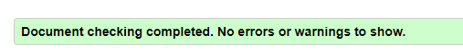
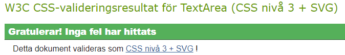
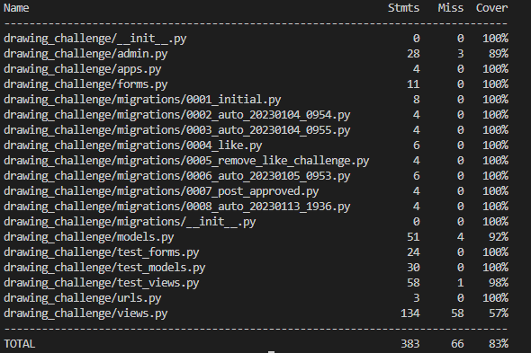

* [Testing](#testing)
    * [Validator Testing](#validator-testing)
    * [Automated Testing](#automaten-testing)
    * [Manual Testing](#manual-testing)
    * [Bugs](#bugs)
    * [Unsolved Bugs](#unsolved-bugs)

---

## Testing

### **Validator Testing**

  * **HTML**
[W3C HTML Validator](https://jigsaw.w3.org/css-validator/validator) was used to validate the html written for the project.

  * **CSS**
  [W3C CSS Validator](https://jigsaw.w3.org/css-validator/validator) was used to validate CSS written for this project, no issues were found.

  

  * **Python PEP8**

  * **Lighthouse**

### **Automated Testing**
Some automated unit testing was written for this project. Due to inexperience of writing automated tests it was taking up too much of the little time I had left before deadline. I still felt like it was necessary to write tests and learn as much as I could since I'm sure unit testing will be more important for future projects. I've been as thorough as I can with the manual testing to try and compensate for the gaps in the automated testing.

* Coverage is at 83%. This will definitely be improved for the next project!

### **Manual Testing**

### **Site Navigation**

| Element                | Action        | Expected Result                                                    | Pass/Fail |
| ---------------------- | ------------- | ------------------------------------------------------------------ | --------- |
| **Main navbar**        |               |                                                                    |           |
| Home Link              | Click         | Redirect to homepage                                               | Pass      |
| Browse Art Dropdown    | Click         | Display menu link 'Past Challenges'                                | Pass      |
| Past Challenges Link   | Click         | Redirect to Past Challenges page                                   | Pass      |
| Signup Link            | Click         | Redirect to signup page                                            | Pass      |
| Signup Link            | Display       | Not visible to logged in user                                      | Pass      |
| Login Link             | Click         | Redirect to login page                                             | Pass      |
| Login Link             | Display       | Not visible to logged in user                                      | Pass      |
| Logout Link            | Click         | Direct to logout confirmation page                                 | Pass      |
| Logout Link            | Display       | Only visible to logged in user                                     | Pass      |
| **Main Navbar Mobile** | Responsive    | Collapses on smaller screen sizes <575px                           | Pass      |
| Collapsed navigation   | Click/Display | Identical links, expected results are the same as above            | Pass      |
| **User Navigation**    |               |                                                                    |           |
| Dropdown user menu     | Click         | Displays links to user profile pages "Your posts" and "Favourites" | Pass      |
| Your Posts Link        | Click         | Redirect to logged in users profile page                           | Pass      |
| Favourites             | Click         | Redirect to logged in users favourites in profile page             | Pass      |

### **Home and Past Challenges Pages**

| Element                    | Action  | Expected result                                                                                     | Pass/Fail |
| -------------------------- | ------- | --------------------------------------------------------------------------------------------------- | --------- |
| **Homepage**               | Display | Display challenges with 'Active' status, e.g challenges that are not older than 48 hours            | Pass      |
| **Past Challenges** page   | Display | Display challenges with 'Inactive' status, e.g challenges that are older than 48 hours              | Pass      |
| Active Challenge Card      | Display | Display a badge with text "NEW! + todays date" if challenge is posted the same date as current date | Pass      |
| Active Challenge Card      | Display | Display how much time has passed since challenge was posted                                         | Pass      |
| Browse Artwork Button Link | Click   | Redirect user to the post list page displaying the user submissions for that challenge              | Pass      |
| Submit Button Link         | Click   | Redirect user to the post submission form page if user is logged in                                 | Pass      |
| Submit Button Link         | Click   | Redirect user to Sign In page if user is not logged in                                              | Pass      |
| Submit Button Link         | Display | Not displaying on 'Inactive' challenges                                                             | Pass      |

---

### **Post List Page and Full Post View**

| Element                      | Action  | Expected result                                                                                                 | Pass/Fail |
|------------------------------|---------|-----------------------------------------------------------------------------------------------------------------|-----------|
| **Post List** page           | Display | Displays correct posts uploaded in the challenge that was clicked                                               | Pass      |
| **Post Cards**               | Display | Displays correctly the owner of the posts username, artwork, title and like button with like counts            | Pass      |
| Post Card Image              | Hover   | Overlay effect with a magnifying glass                                                                          | Pass      |
| Post Card Profile Link       | Click   | Redirects to that users profile page if user is logged in                                                       | Pass      |
| Post Card Profile Link       | Click   | Redirects user to signup page if user is not logged in                                                          | Pass      |
| Post Card Like Button        | Display | Always displays like count, but is only filled in red if user in session has liked the post, otherwise its grey | Pass      |
| Like Button(greyed out)      | Click   | Adds a like to the post, elements are updated without page refresh and are still updated after refresh          | Pass      |
| Like Button(filled in)       | Click   | Removes the like from the post, elements are updated without page refresh and are still updated after refresh   | Pass      |
| Post Card Image              | Click   | Opens a modal to full view of the post                                                                          | Pass      |
| **Full Post View**           | Display | Displays the expected elements correctly                                                                        | Pass      |
| Favourite Button(greyed out) | Click   | Displays a success message and adds post to logged in user's favourites                                         | Pass      |
| Favourited Button(filled in) | Click   | Displays an info message and removes post from logged in user's favourites                                      | Pass      |
| Comment Form                 | Display | Is only displayed for logged in users, else links are displayed to redirect user to signup or signin page       | Pass      |
| Comment Submit               | Click   | Comment will update and display directly upon clicking submit without page refresh                              | Pass      |

---

### **User Profile Pages**

| Element                      | Action        | Expected result                                                                                     | Pass/Fail |
|------------------------------|---------------|-----------------------------------------------------------------------------------------------------|-----------|
| **User Profiles**            | Display       | Will display user's uploaded posts in post gallery, and users favourites in favourite gallery      | Pass      |
| My profile page              | Display       | Acts as a personal profile and can only be accessed via the drop down user menu                     | Pass      |
| Delete/Edit Post Icon Button | Display       | Is only available on 'My Profile' page, posts can only be updated/deleted by the owner of the posts | Pass      |
| Delete Icon Button           | Click         | Opens up a modal to confirm deletion of the post                                                    | Pass      |
| Delete Modal Button          | Click         | Deletes post and updates profile page                                                               | Pass      |
| Edit Icon Button             | Click         | Redirects user to the update post page                                                              | Pass      |
| Editable post content        | Update        | User can only update the title and caption of the post                                              | Pass      |
| View Comments Button         | Click/Display | Opens up a modal that displays comments related to post                                             | Pass      |

### Bugs

#### 
  * **Fix** - 

#### Like Count Not Updating
  * **Expected** - For like count to update without page refresh
  * **Testing** - Googled and checked stackoverflow for different solutions and tested them out as I am inexperienced working with Ajax.
   * **Result** - None of the solutions I tried gave me the result I wanted, but by experimenting with different code snippets I eventually came up with something that worked.
  * **Fix** - I ended up creating a count varible of the span element containing the post like count, adding +1 if liked was true and -1 if liked was false, then updating the text value of the span with that. It works, but there is probably a better solution to this as it's a bit flawed.

#### 
  * **Expected** -
  * **Testing** - 
  * **Result** - .
  * **Fix** - 

### Unsolved bugs
 * As mentioned, the like count not updating fix was flawed, because if you were to spam the like button quickly, the counter does not keep up. But refreshing the page displays everything correctly.
 
---